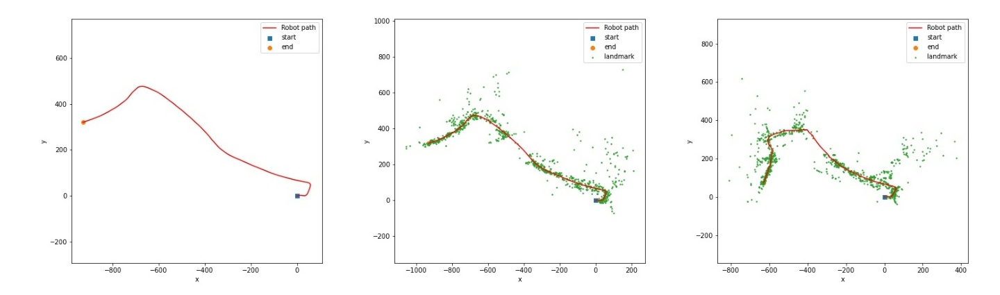
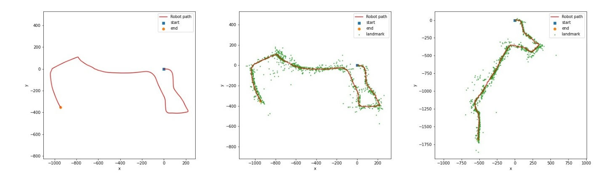
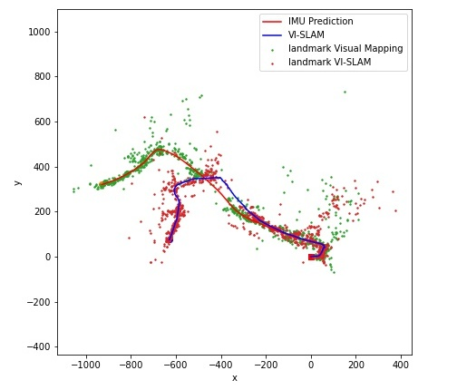
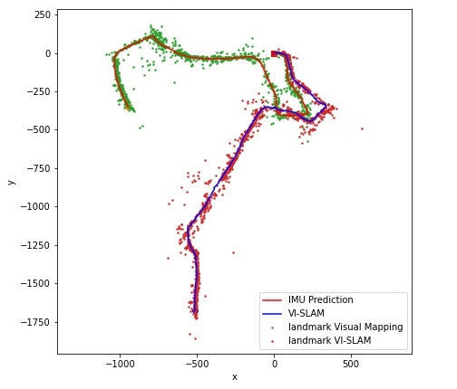

# Assignment 3 - Visual Inertial SLAM

Sequence 1

Sequence 1

# Note

This repo only contains the code and report. To run the code, the associated data needs to be downloaded from the following link - https://natanaso.github.io/ece276a/ref/ECE276A_PR3.zip
